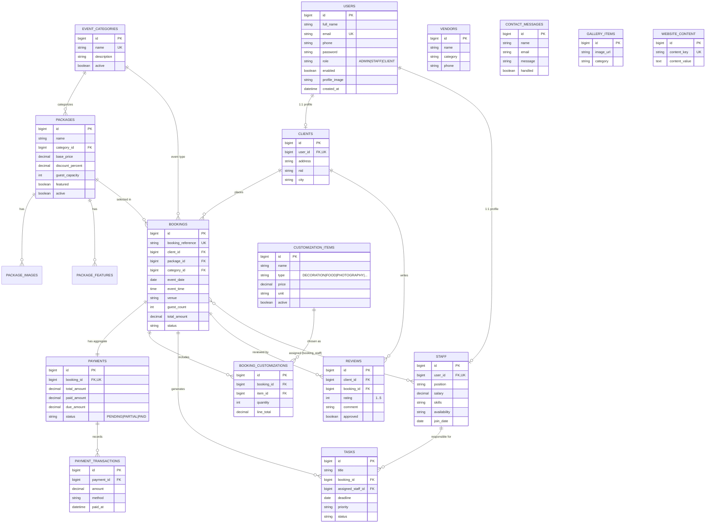

# ER Diagram — Shrabon Decorator & Event Management

The diagram below (Mermaid ERD) describes the normalized relational model.
View it on any Mermaid-compatible renderer (GitHub renders it automatically).

## Relationship summary

| Relationship | Type | Notes |
|---|---|---|
| User → Client | 1:1 | A CLIENT user has one client profile |
| User → Staff | 1:1 | A STAFF user has one staff profile |
| EventCategory → Package | 1:N | Each package belongs to one category |
| EventCategory → Booking | 1:N | Each booking references an event type |
| Package → Booking | 1:N | A booking may be based on a package |
| Client → Booking | 1:N | A client places many bookings |
| Booking → Payment | 1:1 | One aggregate payment per booking |
| Payment → PaymentTransaction | 1:N | Each part-payment is a transaction (receipt) |
| Booking → BookingCustomization | 1:N | Custom builder line items |
| CustomizationItem → BookingCustomization | 1:N | Catalog item chosen in bookings |
| Booking ↔ Staff | M:N | `booking_staff` join table |
| Staff → Task | 1:N | Tasks assigned to staff |
| Booking → Task | 1:N | Tasks tied to a booking |
| Client → Review | 1:N | Clients leave reviews |
